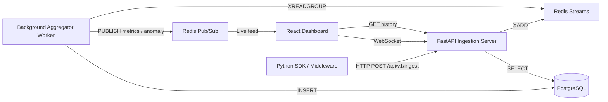
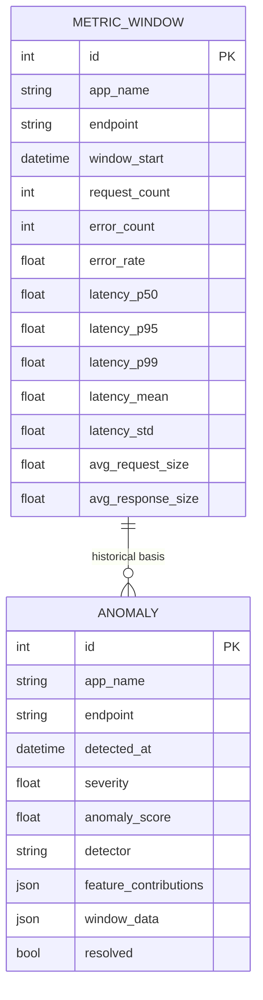

# SentinelAPI

[](https://www.python.org/)
[](https://fastapi.tiangolo.com/)
[](https://reactjs.org/)
[](https://docs.docker.com/compose/)
[](https://redis.io/)
[](https://www.postgresql.org/)

SentinelAPI is a fully integrated real-time API telemetry monitoring and anomaly detection platform. It ingests HTTP telemetry from instrumented services, aggregates endpoint-level metrics, scores anomalies with an ensemble ML engine, and delivers live insights through a WebSocket-powered React dashboard.

---

## Project Overview

SentinelAPI solves a common observability gap: teams often have telemetry data arriving from APIs, but they lack a tightly coupled pipeline that turns request-level events into endpoint performance analytics and anomaly alerts.

This repository exists to demonstrate a complete, production-minded pipeline for API monitoring:

- ingest telemetry from instrumented services via a lightweight Python SDK
- buffer telemetry in Redis Streams for scalable event processing
- aggregate easy-to-action metrics in PostgreSQL
- detect anomalous API behavior with a trained autoencoder + isolation forest ensemble
- stream live dashboard updates to operations teams via WebSocket

Real-world use cases:

- e-commerce checkout and search latency monitoring
- API error storm detection for SaaS platforms
- endpoint performance tracking during traffic surges
- noise-resistant anomaly detection for backend service SLIs

Why this architecture is interesting:

- it decouples ingestion from computation using Redis Streams
- it uses consumer groups to make metrics aggregation resilient
- it combines both deep-learning and classical ML models
- it exposes both realtime and historical API telemetry
- it is fully runnable with Docker Compose

---

## Key Highlights

- FastAPI ingestion server accepting batched telemetry
- Redis Streams buffer and consumer group processing
- 1-minute rolling endpoint aggregation in PostgreSQL
- Ensemble anomaly detection with PyTorch autoencoder + scikit-learn Isolation Forest
- Live React dashboard powered by WebSocket pub/sub
- Python SDK with FastAPI middleware and background batching
- Docker Compose deployment for Redis / Postgres / server / aggregator / dashboard
- Synthetic traffic generator that injects realistic anomalies

---

## Architecture



### Request lifecycle

1. instrumented service sends batched telemetry to `/api/v1/ingest`
2. ingestion server appends each event to a Redis stream keyed by `telemetry:{app_name}:{endpoint}`
3. aggregator worker reads stream entries in a consumer group
4. worker computes 1-minute windows and stores aggregated metrics in PostgreSQL
5. worker evaluates the window with anomaly detectors
6. if anomalous, the system persists the anomaly and publishes a live event
7. dashboard clients receive metric and anomaly updates over WebSocket and render charts

### Data flow

- raw event: `endpoint`, `method`, `latency_ms`, `status_code`, `request_size`, `response_size`, `timestamp`
- aggregated window: request counts, error rates, latency percentiles, means, standard deviations, payload averages
- anomaly signal: reconstruction score, severity, feature contributions

---

## Features

### Authentication

- No authentication middleware is implemented in this repository
- CORS is enabled for demo use and should be hardened for production

### Backend APIs

- `POST /api/v1/ingest` accepts batched telemetry events
- `GET /api/v1/health` verifies Redis connectivity
- `GET /api/v1/dashboard/endpoints` returns discovered endpoints and latest stats
- `GET /api/v1/dashboard/metrics/{app_name}/{endpoint}` returns historical windowed metrics
- `GET /api/v1/dashboard/anomalies` returns recent anomaly records
- `GET /` returns service metadata
- `WS /ws/dashboard` streams live metric and anomaly updates

### Data Processing

- Redis Streams used as the ingestion buffer
- Consumer group `aggregator` reads new entries with `XREADGROUP`
- 60-second aggregation windows are computed in the aggregator
- metric windows are persisted in PostgreSQL
- anomaly detection is performed on each completed window

### Database

- `MetricWindow` stores aggregated endpoint-level time series
- `Anomaly` stores detected anomaly records, severity, and contributing features
- SQLAlchemy ORM is used for schema definitions and session management
- DB tables are created on application startup via `Base.metadata.create_all(engine)`

### Real-Time Features

- WebSocket endpoint publishes `metrics:*` and `anomaly:*` events
- React dashboard consumes live updates and refreshes charts instantly
- Dashboard also fetches 24h anomaly history on load

### Security

- Secret configuration is handled via environment variables (`.env` / Docker Compose)
- Use `.env.example` as a template and never commit `.env` to GitHub
- No JWT, OAuth, OTP, or role-based auth is present today
- Redis and PostgreSQL should be secured for production deployment
- Backend uses a background buffering SDK that avoids blocking application requests

### Dashboard

- React SPA rendered from `dashboard/src/App.tsx`
- Endpoint list with health and p95 / error / RPS stats
- Time-series charts for latency, throughput, and error rate
- Anomaly feed with severity and top contributing features
- `recharts` charts plus a custom `useWebSocket` hook

### Monitoring

- `GET /api/v1/health` for service health checks
- live dashboard connection state and analytics
- metric and anomaly pub/sub for real-time operations

### Infrastructure

- `docker-compose.yml` orchestrates Redis, PostgreSQL, backend, aggregator, dashboard
- `docker/Dockerfile.server` builds the FastAPI backend on Python 3.11-slim
- `docker/Dockerfile.dashboard` builds React assets and serves them via nginx

### Developer Experience

- Python SDK installable via `sdk/setup.py`
- Demo script `scripts/demo_traffic.py` generates realistic normal + anomalous traffic
- Minimal local setup with virtualenv and `npm install`
- Live dashboard development mode supported by `npm start`

---

## Technical Deep Dive

### Architectural decisions

- Redis Streams were chosen to decouple ingestion from aggregation and provide durable buffering.
- A separate aggregator worker prevents telemetry spikes from affecting the ingestion API.
- PostgreSQL stores aggregated analytics instead of raw event logs, making queries and dashboards efficient.
- The dashboard consumes live updates over WebSocket while also supporting historical metrics via REST.

### ML design

- The autoencoder is a 10-dimensional network with bottleneck compression and reconstruction loss.
- The anomaly threshold is derived from training reconstruction error statistics.
- Isolation Forest is trained in parallel and used as an ensemble confidence boost.
- This hybrid architecture balances deep-learning sensitivity with classical anomaly robustness.

### Scalability considerations

- Streams are keyed by `telemetry:{app_name}:{endpoint}` so hot endpoints can be isolated.
- `xadd(..., maxlen=50000)` bounds stream memory consumption per endpoint.
- The aggregator uses Redis consumer groups for eventual horizontal scaling.

### Performance optimizations

- SDK batches events with a background flush thread instead of sending one HTTP request per request.
- Aggregator uses vectorized NumPy computations for percentile and statistics calculations.
- The dashboard only retains the most recent 120 live points to keep the UI responsive.

### Reliability considerations

- The SDK drops telemetry rather than blocking client requests under back-pressure.
- Database sessions are scoped per request and closed after use.
- Redis Pub/Sub is used for live updates, while PostgreSQL provides durable history.

### Security considerations

- `.env` is ignored by `.gitignore`; use `.env.example` as a template and never commit secrets to GitHub.
- Environment variables are the current secret management mechanism.
- Production-ready deployment should add authentication, encrypted transports, and secret store integration.

---

## Tech Stack

| Layer | Technology | Version |
|---|---|---|
| Frontend | React | 19.2.6 |
| Frontend | Recharts | 3.8.1 |
| Backend | FastAPI | 0.111.0 |
| Backend | Uvicorn | 0.30.0 |
| Backend | SQLAlchemy | 2.0.30 |
| Backend | Redis client | redis 5.0.0 |
| Database | PostgreSQL | 16-alpine |
| Caching / Streaming | Redis | 7-alpine |
| ML | PyTorch | 2.0.0 |
| ML | scikit-learn | 1.2.2 |
| ML / Data | NumPy | 1.24.4 |
| DevOps | Docker Compose | 1.0+ |
| SDK | httpx | 0.27.0 |
| Config | pydantic-settings | 2.0.0 |

---

## API Documentation

### `POST /api/v1/ingest`

Description: ingest telemetry batches from instrumented services.

Request body:

```json
{
  "events": [
    {
      "endpoint": "/api/checkout",
      "method": "POST",
      "status_code": 200,
      "latency_ms": 42.3,
      "request_size": 512,
      "response_size": 1024,
      "timestamp": 1690000000.0,
      "app_name": "default",
      "metadata": {}
    }
  ]
}
```

Response:

```json
{
  "status": "ok",
  "events_ingested": 1
}
```

### `GET /api/v1/health`

Response:

```json
{
  "status": "healthy"
}
```

### `GET /api/v1/dashboard/endpoints`

Response:

```json
{
  "endpoints": [
    {
      "app_name": "demo-shop",
      "endpoint": "/api/checkout",
      "latest_p95": 120.5,
      "latest_error_rate": 0.02,
      "latest_rps": 15
    }
  ]
}
```

### `GET /api/v1/dashboard/metrics/{app_name}/{endpoint}`

Query parameter: `hours` (default `1`, max `72`)

Response:

```json
{
  "endpoint": "/api/checkout",
  "data": [
    {
      "timestamp": "2026-06-04T12:00:00+00:00",
      "request_count": 40,
      "error_rate": 0.025,
      "latency_p50": 110.2,
      "latency_p95": 140.8,
      "latency_p99": 220.4
    }
  ]
}
```

### `GET /api/v1/dashboard/anomalies`

Query parameter: `hours` (default `24`, max `168`)

Response:

```json
{
  "anomalies": [
    {
      "id": 1,
      "endpoint": "/api/checkout",
      "app_name": "demo-shop",
      "detected_at": "2026-06-04T12:12:34.567890+00:00",
      "severity": 0.82,
      "score": 1.2345,
      "features": [
        {"feature": "latency_p95", "deviation": 0.5421},
        {"feature": "error_rate", "deviation": 0.3124}
      ]
    }
  ]
}
```

### WebSocket: `ws://localhost:8100/ws/dashboard`

Payloads from the server are JSON objects of the form:

```json
{
  "channel": "metrics:demo-shop:/api/checkout",
  "data": {
    "endpoint": "/api/checkout",
    "app_name": "demo-shop",
    "request_count": 40,
    "error_rate": 0.025,
    "latency_p50": 110.2,
    "latency_p95": 140.8,
    "latency_p99": 220.4,
    "latency_mean": 125.1,
    "timestamp": "2026-06-04T12:01:00+00:00"
  }
}
```

and anomaly events:

```json
{
  "channel": "anomaly:demo-shop:/api/checkout",
  "data": {
    "endpoint": "/api/checkout",
    "app_name": "demo-shop",
    "detected_at": "2026-06-04T12:12:34.567890+00:00",
    "severity": 0.82,
    "score": 1.2345,
    "features": [
      {"feature": "latency_p95", "deviation": 0.5421}
    ]
  }
}
```

---

## Database Design



- `MetricWindow` is the central analytics entity for endpoint behavior over fixed time windows.
- `Anomaly` captures each detected event with detector score and feature deviation details.
- The aggregator writes metrics continuously while the ML pipeline persists anomalies for investigation.

---

## Real-Time Pipeline

1. SDK writes telemetry to the backend in batches.
2. Backend stores events in Redis Streams with per-endpoint stream keys.
3. Aggregator consumes streams through a Redis consumer group.
4. Completed windows are persisted in PostgreSQL and published to Redis Pub/Sub.
5. Dashboard clients reconnect automatically and render live metric/anomaly events.

This design preserves durability, supports backpressure, and keeps the dashboard decoupled from raw ingestion.

---

## Security

- Environment-driven configuration: `REDIS_URL`, `DATABASE_URL`
- Open CORS for demo mode; production should restrict origins
- No authentication or authorization is implemented in the current codebase
- SDK fails gracefully on ingestion failure instead of blocking the application
- `docker-compose.yml` uses default credentials for local demo only

> Note: `server/app/services/alerting.py` contains alerting utilities, but those functions are not wired into the current aggregator pipeline.

---

## Deployment Guide

### Docker Setup

From the repository root:

```powershell
docker compose up --build
```

Services started:

- `redis` on `localhost:6379`
- `postgres` on `localhost:5432`
- `server` API on `http://localhost:8100`
- `aggregator` worker
- `dashboard` UI on `http://localhost:3000`

### Local Setup

1. Create a Python virtual environment:

```powershell
cd c:\Users\thakk\Desktop\api-generator
python -m venv .venv
& .venv\Scripts\Activate.ps1
```

2. Install backend dependencies:

```powershell
pip install -r server\requirements.txt
```

3. Install dashboard dependencies:

```powershell
cd dashboard
npm install
```

4. Configure local environment by copying the example and editing sensitive values:

```powershell
copy .env.example .env
```

Then update `.env` with local or secret values, for example:

```text
REDIS_URL=redis://localhost:6379
DATABASE_URL=postgresql://<user>:<password>@localhost:5432/<database>
```

> `.env` is explicitly ignored in this repository. Do not commit secret credentials to GitHub.

5. Start the backend:

```powershell
cd server
uvicorn app.main:app --host 0.0.0.0 --port 8100
```

6. Start the worker:

```powershell
cd server
python -m app.workers.aggregator
```

7. Start the dashboard:

```powershell
cd dashboard
npm start
```

### Environment Variables

- `REDIS_URL` — Redis connection string
- `DATABASE_URL` — PostgreSQL connection string
- `REACT_APP_WS_URL` — optional dashboard WebSocket URL override

### Production Deployment

- Build backend container with `docker/Dockerfile.server`
- Build dashboard static assets with `docker/Dockerfile.dashboard`
- Use `docker compose up --build` for end-to-end deployment
- Replace default credentials and lock down CORS/origins

---

## Screenshots


---

## Engineering Challenges

- Building a streaming ingestion path that is resilient to bursts while preserving enough history for ML training.
- Picking a compact feature set for endpoint windows so anomaly models can learn without raw trace data.
- Balancing real-time WebSocket publication with asynchronous Redis-backed persistence.
- Creating a pip-installable SDK that instruments request latency without adding user-facing overhead.
- Tying together PyTorch and scikit-learn models in a single detector orchestration layer.

---

## Why This Project Stands Out

- It is a full-stack distributed observability pipeline, not just a dashboard or a model.
- It demonstrates event-driven ingestion using Redis Streams and consumer groups.
- It combines real-time streaming with historical analytics storage.
- It includes an ML ensemble for anomaly detection rather than a simple threshold.
- It is deployable end-to-end with Docker Compose and a demo traffic generator.

---

## Metrics

- Services: 5 (`redis`, `postgres`, `server`, `aggregator`, `dashboard`)
- API endpoints: 7 (including `/`, health, ingestion, dashboard endpoints, websocket)
- Database entities: 2 (`MetricWindow`, `Anomaly`)
- Background workers: 1 aggregator
- Frontend components: 4 main UI components, plus 1 custom WebSocket hook

---

## Quick Start

```powershell
cd c:\Users\thakk\Desktop\api-generator
docker compose up --build
```

Open `http://localhost:3000` and run the demo traffic generator:

```powershell
python .\scripts\demo_traffic.py --normal-minutes 2 --anomaly-index 0
```
